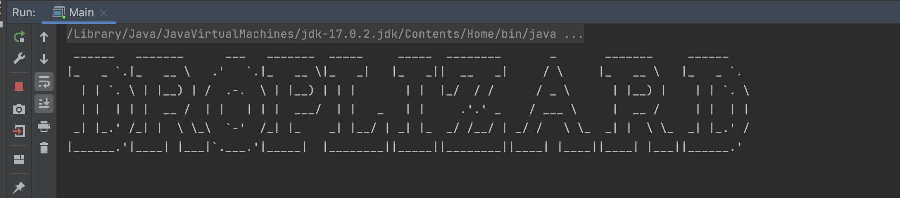
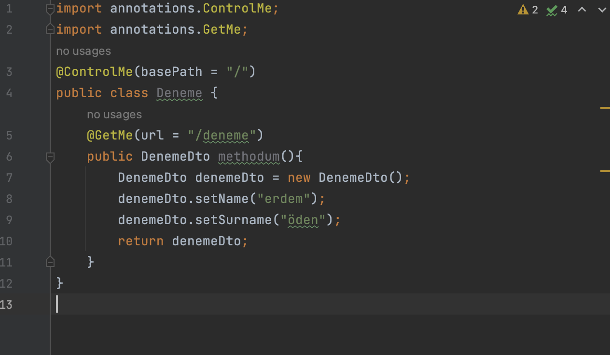
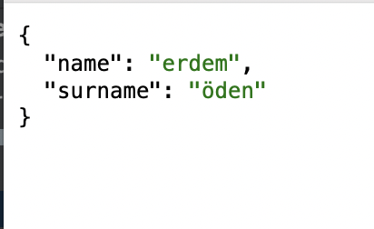

# DROPLIZARD Framework - Make Java Great Again !

  

  

<b>Note : </b>It's fairly new framework and it has one issue it supports just http get.

 
<b>How To Use : </b>
 
After downloading this project, you can compile it with Maven and then use it in your local project as follows : 

  

if you create class like image above you can send get request to localhost:8080/deneme and get denemeDto class as json like image below

  

